&nbsp;

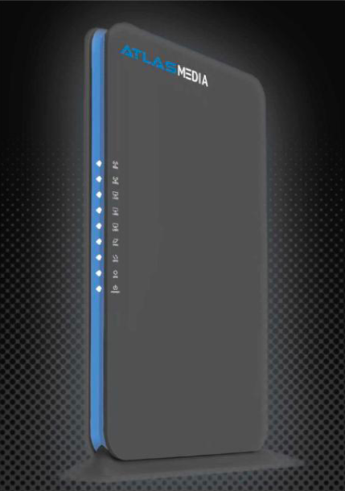

<h1 align="center">Install OpenWrt on an Atlas Media AMW-DBR 1200AC Router<br /><i>the E-Z way!</i></h1>

<div style="page-break-after: always;"></div>

## Intro

We currently have several hundred Atlas Media AMW-DBR 1200AC routers at Iffy Books, which otherwise would've ended up in a landfill. Someone initially offered to donate them to Philly Community Wireless, a group that gives out free wi-fi in Philly's Norris Square neighborhood, but they didn't have a use for them. They're from 2016 and they haven't had a security update lately, so they're essentially useless. PCW let us know they were available, so we we took them all with the goal of installing open firmware like OpenWrt and doing something cool.

Little by little, we figured it out. This zine will show you how to install OpenWrt on an Atlas Media router, which you can get for $8 at Iffy Books (319 N. 11th St. #2I, PHL). We're splitting the proceeds with PCW. 

Special thanks to Retry and Jim for putting in the work and showing us how to get OpenWrt onto these routers.Thanks to Anthony for doing initial research and spreading the word about the project.

## Caveats

This is a big one: When you're using OpenWrt on one of these routers, wi-fi won't work. That's because it uses Broadcom wi-fi hardware, which needs a proprietary driver that isn't included in OpenWrt.

Also: Due to limited storage space on the device, we can't install a full, updated version of OpenWrt. We're using a custom, smaller OpenWrt build created by our pal Retry in mid-2023. With only 2MB of storage remaining, you probably won't be able to update any software.

## Getting started

- Download the firmware from the following URL:  https://iffybooks.net/AtlasMediaOpenWrt.trx

- Plug in the router's AC adapter to turn it on.

- On your computer, connect to the wi-fi network beginning with "Atlas_"
  
  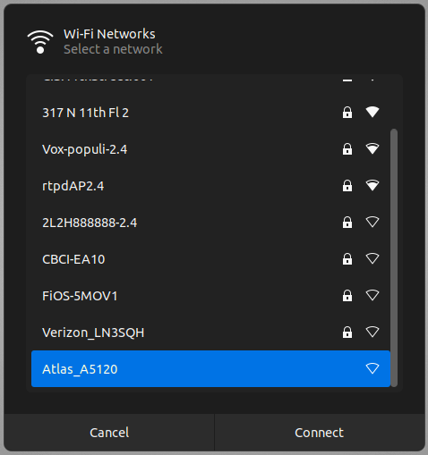

- A window should pop up with a prompt to log into the router admin panel. Enter the password "**admin**" and click **Login**.
  
  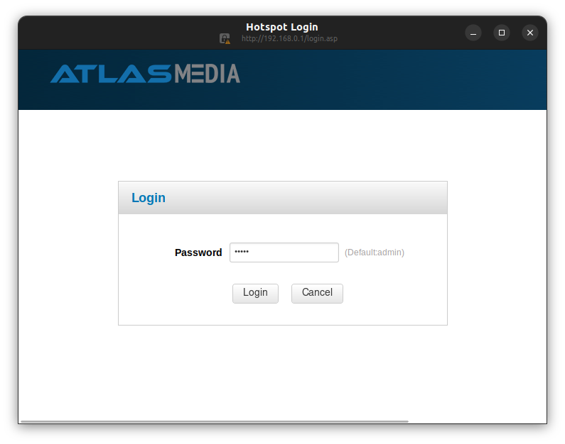

<div style="page-break-after: always;"></div>

## Enable telnet

- Open a browser window, type the following URL, and press enter. You'll see the text "load telnetd success." You've just enabled telnet access on the router. (You'll need to be logged into the router admin panel for this to work.)

```
http://192.168.0.1/goform/telnet  
```

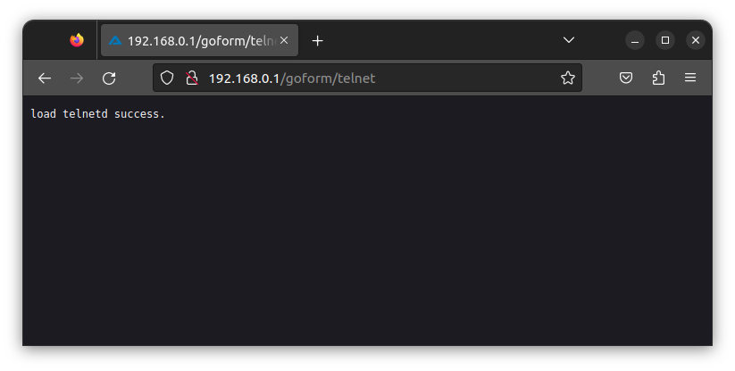

- Open a new terminal window. Type the command below and press enter to start a telnet session with your router.

```
telnet 192.168.0.1
```

<div style="page-break-after: always;"></div>

- Log in with username "**root**" and password "**Fireitup**"

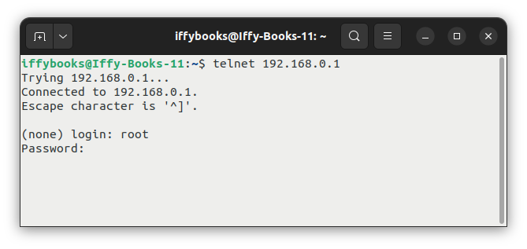

- Run the following three commands to make the router boot into CFE (common firmware environment) mode for 15 seconds every time you turn it on, letting you upload new firmware.

```
nvram set boot_wait=on
nvram set wait_time=15
nvram commit
```

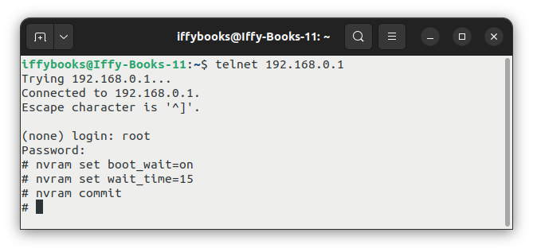

## Give yourself a static IP address

- Turn off wi-fi on your computer.

- Connect an Ethernet cable to the LAN1 port on your router, then connect the other end to your computer.

- In Ubuntu, go to `Settings > Network` and make sure the wired connection is turned on. Click the gear icon to the right of the toggle switch to open the options.

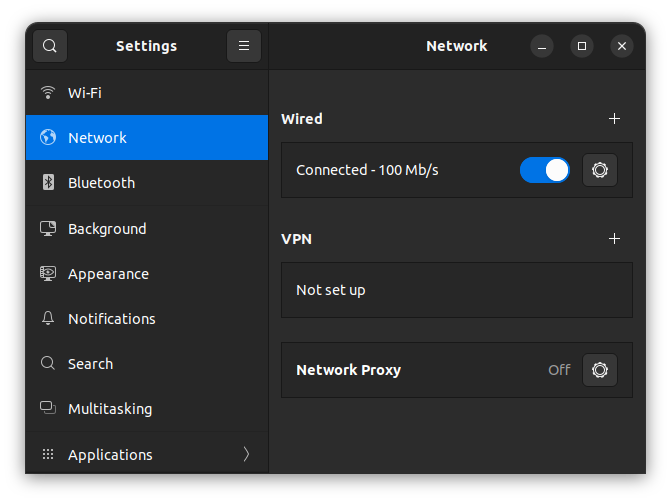

- Go to **IPv4** and select **Manual**.

<div style="page-break-after: always;"></div>

- Enter an IP address like the one below. The first three numbers separated by dots should match exactly, and the last number can be any integer from 2 to 254.

```
192.168.1.240
```

Under **netmask**, enter the following:

```
255.255.255.0
```

Click **Apply**.

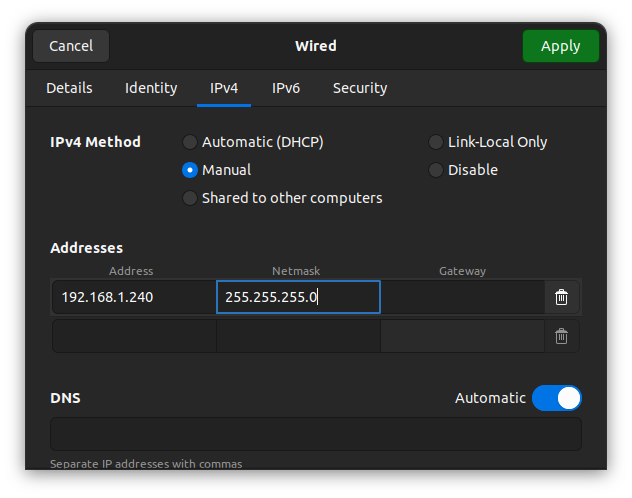

- Open a browser window and enter the following IP address in the URL bar. Don't press enter yet.

```
http://192.168.1.1
```

- Unplug your router and plug it back in. Wait for the lights to come on, then press enter to load the page in your browser.

- You should see a page titled "Broadcom CFE something". If it doesn't work, unplug your router and try again.

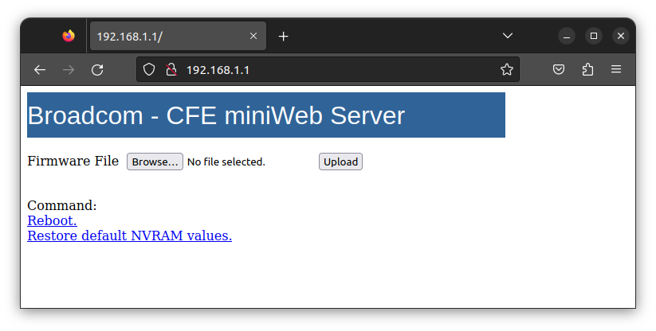

- Click **Browse...** and select the file **AtlasMediaOpenWrt.trx** you downloaded earlier. Click **Upload**.

- When the file is finished uploading, you'll see a page that says "Upload completed. System is going to reboot. Please wait a few moments."

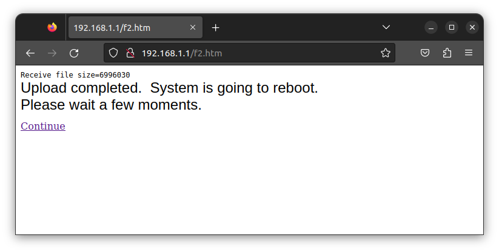

- Leave your router alone for 3 minutes or so and don't unplug it. It's getting things set up.

- In your browser, enter the following IP ddress to open the OpenWrt admin panel:

```
http://192.168.1.1
```

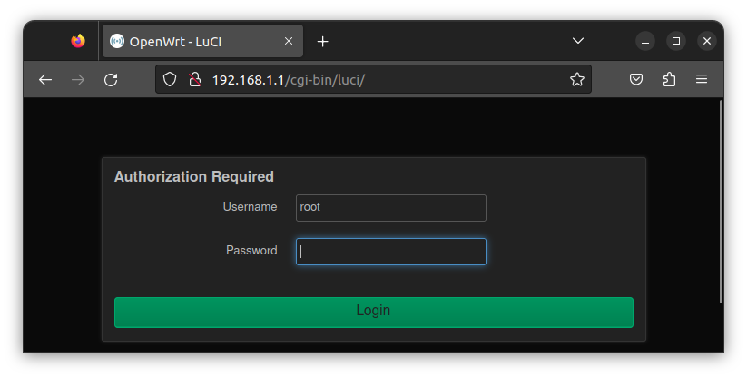

- Leave the password field blank and click **Login**.

- Click **Go to password configuration...** at the top of the page and set a new password for your router. 

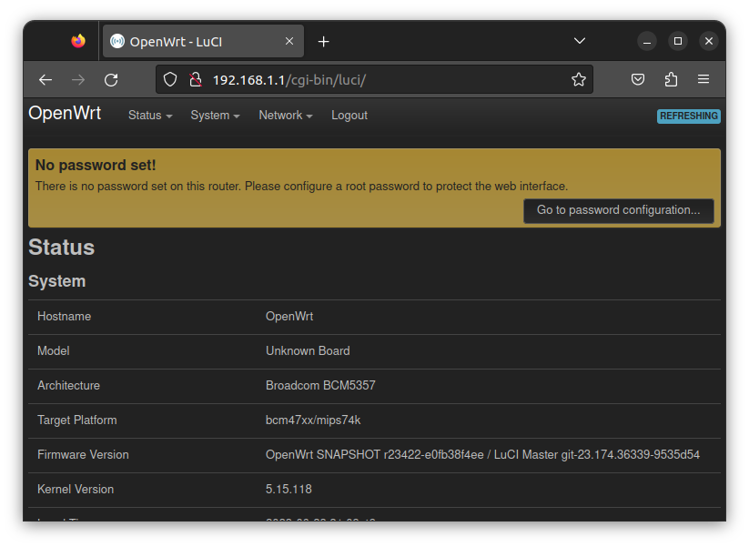

- Have fun!

<div style="page-break-after: always;"></div>

&nbsp;
&nbsp;
&nbsp;
&nbsp;<br />
&nbsp;<br />
&nbsp;<br />
&nbsp;<br />
&nbsp;<br />
&nbsp;<br />
&nbsp;<br />
&nbsp;<br />
&nbsp;<br />
&nbsp;<br />
&nbsp;<br />
&nbsp;<br />
&nbsp;<br />
&nbsp;<br />
&nbsp;<br />
&nbsp;<br />
&nbsp;<br />
&nbsp;
&nbsp;&nbsp;
&nbsp;
&nbsp;


**Anti-copyright 2023**

**Iffy Books**

**319 N. 11th St. #2I, PHL**

**iffybooks.net**