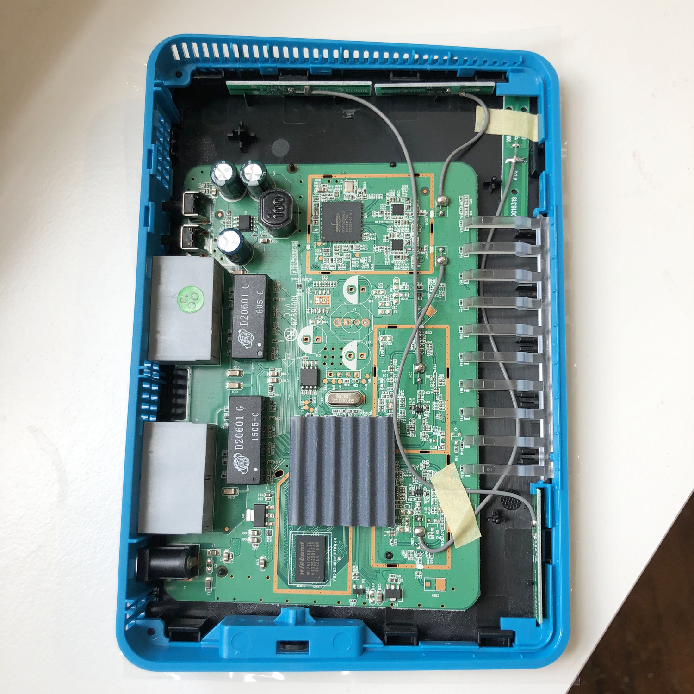
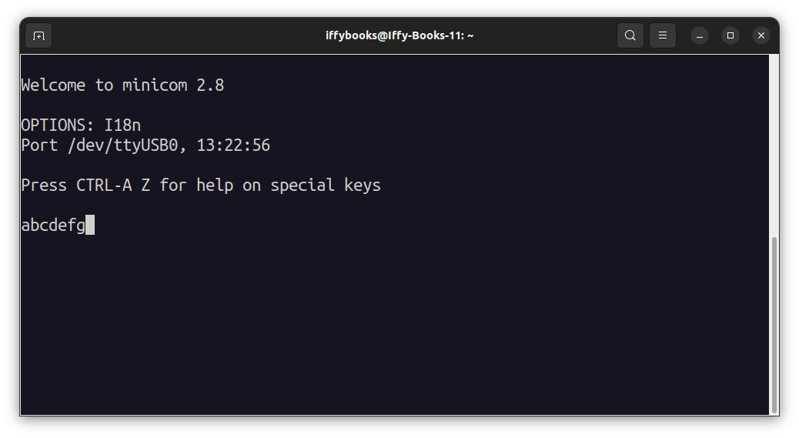
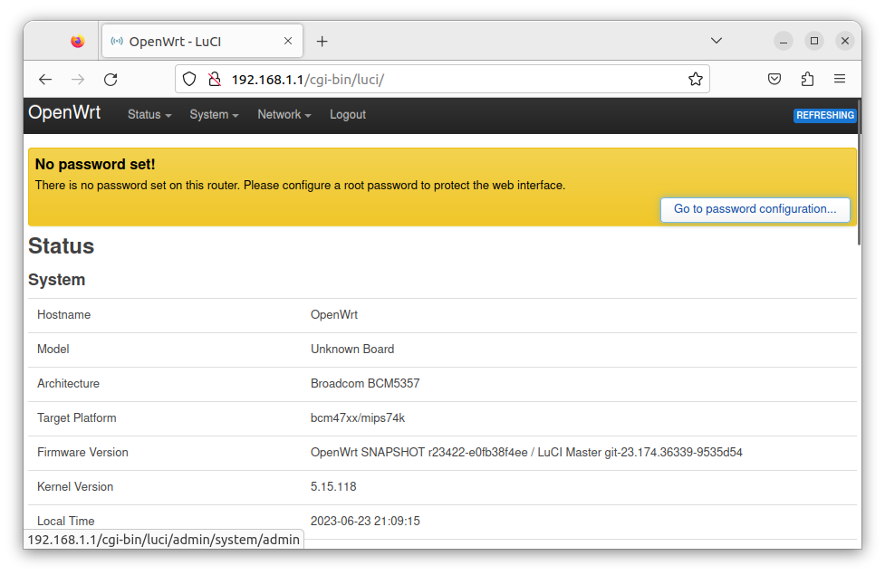

# Install OpenWrt on your Atlas Media Router

*[This zine is still a draft. Last updated July 27, 2023.]*

The Iffy Books router challenge is complete! We have a working build of OpenWrt that you can install on the Atlas Media routers we've been hacking away at for the past few months! Retry and Jim are sharing the prize, which we'll award at [Router Hack Day III](https://iffybooks.net/event/router-hack-day-3/) on Saturday, July 29th. We should also thank Anthony, who helped with initial research and did a great job spreading the word about the project.

This post will show you how to install Retry's build of OpenWrt on your Atlas Media AC1200 router (actually a rebranded Tenda FH1205 router). This project doesn't require any soldering, but you will need to disassemble the router's case and connect a couple wires to the board.

If you're interested in soldering wires to the router's serial pinout to access the serial shell, check out our blog post 'Notes from Router Hack Day II.' That post will also get you started on decompressing the router's stock firmware:
❏ https://iffybooks.net/router-hack-day-2

For background info and instructions on gaining telnet access using the router's stock firmware, check out Jim's progress report from March:
❏ https://iffybooks.net/challenge-router-progress

For hardware specs and manuals, check out the event page for our first Router Hack Day event:

❏ https://iffybooks.net/event/router-hack-day

## Getting started

❏ Download the OpenWrt firmware from the following URL:
https://iffybooks.net/AtlasMediaOpenWrt.trx

❏ Go to your computer's wi-fi settings and turn off wi-fi completely. Here's what that looks like in Ubuntu Linux:

&nbsp;

❏ Connect your Atlas Media router to your computer with an ethernet cable. Then attach the power cable.

&nbsp;

## Give yourself a static IP address

Next you'll assign yourself a static IP address on the network. Here's why this step is necessary: In order to flash new firmware to your router, you'll need to boot into CFE (Common Firmware Environment) mode, a bare-bones version of the router's OS. CFE mode doesn't offer DHCP (Dynamic Host Configuration Protocol), which is the typical way a router assigns IP addresses to connected devices.

***Instructions for Ubuntu:***

❏ Go to **Settings > Network**. Under **Wired**, make sure your connection is turned **on**. Then click the **gear** on the right side.

&nbsp;

❏ Go to the **IPv4** tab and make the following changes:

    - Switch **IPv4 Method** to **Manual**.

    - Under **Address**, enter the IP address **192.168.1.X**, replacing X with a number from 0 to 255. 

    - Set **Netmask** to **255.255.255.0**.

&nbsp;

❏ Click **Apply** to save your changes.

***Instructions for macOS:***

❏ Go to **System Preferences > Network**. Find your Ethernet interface in the left column and click on it.

❏ Switch **Configure IPv4** to **Manually**.

❏ For **IP Address**, enter **192.168.1.X**, replacing X with a number from 0 to 255.

❏ For **Subnet Mask**, enter **255.255.255.0**.

❏ Click **Apply** to save your changes.

***Instructions for Windows:***

[Coming soon]

## Set up your USB serial interface

Your Atlas Media router runs at 3.3V, so you'll want to use a USB serial interface that matches.

❏ Find your **alligator-to-jumper wire** and connect the jumper end to the **GND** pin on your USB serial interface.

&nbsp;

❏ Attach the **port** end of a **port-to-plug jumper wire** to the **Tx** pin (short for "Transmit").

## Remove the router's faceplate

❏ Disconnect the power cable and Ethernet from your router.

❏ Find the screw on the bottom of your router, using a **Phillips-head screwdriver** to pierce through the label. Unscrew the screw and remove the base.

&nbsp;

❏ With the wider side of the router facing left, pry off the front panel of the case. It's easiest to start at the top corner on the narrow end.

Here's what the router looks like inside:

❏ Locate the pin indicated in the photo below, which is the **Rx** pin (short for "Receive") for the router's serial pinout. (The Tx pin is directly to the right, and GND is on the left. We're only using the Rx pin for this tutorial.)

## Install Minicom and test your USB serial interface

❏ In Ubuntu, open a terminal window and run the following command to install [Minicom](https://en.wikipedia.org/wiki/Minicom), a program you'll use to send serial data to your router.

    sudo apt-get install minicom

❏ Attach the **USB serial interface** to a USB port on your computer.

 

❏ Open a terminal window and run the following command to launch a Minicom session:

    minicom -D /dev/ttyUSB0 -c on

❏ Next you'll test your USB serial adapter. Touch the plug end of your **Tx** jumper wire to the **Rx** pin, then type a few characters in the Minicom window. If the characters appear onscreen, your USB serial interface is working.

## Boot your router into CFE mode

❏ Reconnect the Ethernet cable to your router.

❏ Attach the alligator clip from your USB serial interface to the exposed metal on one or both of the router's external buttons.

 

❏ Touch the plug end your **Tx** jumper wire to the **Rx** pin hole indicated in the photo below. Hold it there firmly for the next step.

 

❏ Make sure your Minicom terminal window is still open. Plug in your router and immediately press **ctrl+C** on your keyboard repeatedly. You'll need to start less than a second after the router's lights turn on.

❏ Open your browser and go to the following address, using **http** at the beginning of the URL instead of "https", which your browser may use by default: **http://192.168.1.1**

If you're in CFE mode, you'll see a page like the one below. If you don't, skip back to the previous step and try again.

❏ Click **Browse ...** and select the firmware file, **AtlasMediaOpenWrt.trx**.

❏ Click **Upload** to start uploading the file.

❏ When you see the page below, it means your firmware has been uploaded successfully.

❏ Wait a minute or two for OpenWrt to finish setting up, then go the following address in your browser:
http://192.168.1.1

❏ There's no password by default. Press enter to log in.

❏ Set a new password.

❏ If your home router (or something else) is using the IP address 192.168.1.1, you'll need to change your router's LAN IP address. Change the IP address to 192.168.1.X, where X is a number <= 255, but not 1.

Details at the following URL: https://openwrt.org/docs/guide-user/network/openwrt_as_routerdevice

❏ Before reassembling your router's case, you may want to drill holes in it to provide access to the ground and Rx pins in case you want to re-flash the firmware later.

❏ Remove the alligator clip from the router.

❏ Snap the case back together. (You may want to disconnect power while you do this.)

❏ Screw on the router's base.

## Now the fun begins! If you make something cool with OpenWrt on your Atlas Media router, send an email to iffybooks@iffybooks.net and let us know.
